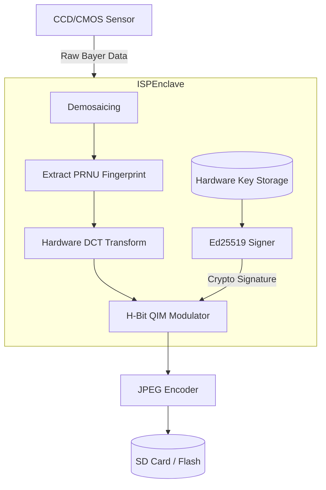
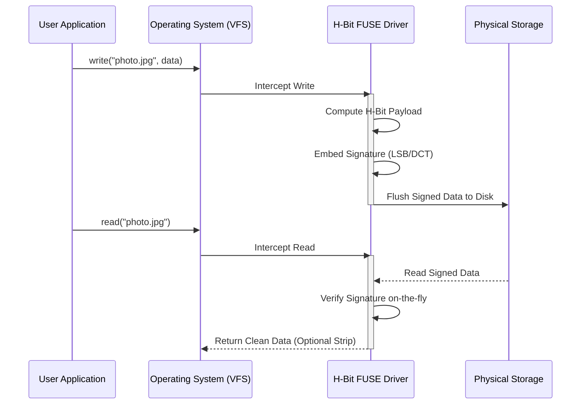

# H-Bit Hardware Integration Architecture

This document outlines the Phase 11 architecture for integrating the H-Bit protocol directly into hardware and operating systems. This represents the ultimate goal of the protocol: achieving zero-trust authenticity directly from the point of capture.

## 1. ISP Enclave Integration (Cameras & Smartphones)

The most secure implementation of H-Bit occurs inside the Image Signal Processor (ISP) of the capturing device.

### Architecture

### Security Guarantees
- The private key never leaves the ISP silicon.
- The image is signed *before* it exists in system RAM.
- Malware on the phone's OS cannot manipulate the image before signing.

---

## 2. HSM & Smart Card Signing

For high-security enterprise environments (journalism, evidence collection), H-Bit supports delegating the cryptographic signing step to external Hardware Security Modules (YubiKey, AWS CloudHSM, smart cards).

### Implementation (Mocked in `hsm_signer.py`)
Instead of `HBitKeyPair`, the `UniversalEncoder` accepts an `HSMSigner` instances.
1. The encoder generates the `CorePayload` bytes.
2. The bytes are sent via PKCS#11 or APDU commands to the HSM.
3. The HSM signs the bytes internally and returns the 64-byte Ed25519 signature.
4. The encoder embeds the signature into the carrier file.

---

## 3. HBFS: Native File System Driver

The H-Bit File System (HBFS) transforms a standard hard drive into an Authenticated Data Vault.

### Architecture (FUSE/Kernel Minifilter)

### Current Status
Phase 11 preparations have been completed with the mock interfaces located in `src/hbit/hardware/`. These mocks define the exact Python APIs that future C/C++ native extensions will implement.
