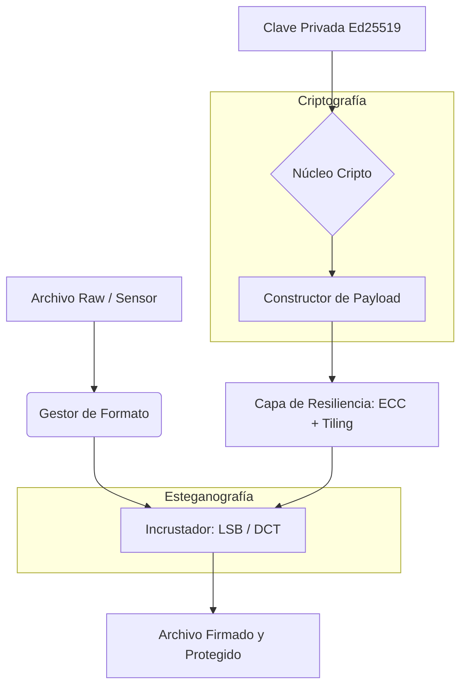

# H-Bit — Protocolo de Autenticidad Persistente

[🇺🇸 Read in English](README_EN.md) | [🇪🇸 Leer en Español](README.md)

**H-Bit** es un sistema de firmado esteganográfico universal que establece un vínculo inalienable entre la autoría intelectual y cualquier archivo digital: imágenes, audio, video, documentos PDF/Office y cualquier formato presente o futuro.

## Características

- **Firmado Universal**: Firma cualquier formato de archivo (imágenes, audio, video, documentos, genérico)
- **Esteganografía Avanzada**: LSB, DCT (resistente a compresión JPEG), Híbrido
- **Criptografía Moderna**: Ed25519, HKDF (RFC 5869), AES-256-GCM
- **Resiliencia Analógica**: Reed-Solomon ECC, Tiling, Anchor Grid OFDM, Dewarp
- **Integración Blockchain**: Registro en Polygon, Manifiestos C2PA
- **Análisis Forense**: PRNU (huella de sensor), Análisis de Luminancia
- **Aceleración GPU**: Backend CuPy con fallback automático a NumPy
- **HBFS Prototype**: Sistema de archivos autenticado con watchdog + identity registry

## Cómo Funciona (Fundamentos Técnicos)

H-Bit incrusta las firmas criptográficas directamente en la capa de datos del medio portador (píxeles, muestras de audio, frecuencias DCT). Debido a que los datos se incrustan a amplitudes por debajo del umbral de **Diferencia Apenas Perceptible (JND)**, permanecen invisibles para los humanos pero son perfectamente legibles por las máquinas.

### Arquitectura del Protocolo



### Criptografía Central
La identidad del autor se hashea de forma determinista y se vincula a su clave privada:
```math
AuthorHash = SHA-256(PrivateKey \parallel DeviceID \parallel SensorNoise \parallel Timestamp)
```
El payload (carga útil) está protegido con **AES-256-GCM** y firmado usando **Ed25519**:
```math
Signature = Ed25519.sign(PrivateKey,\ Version \parallel Flags \parallel AuthorHash \parallel ContentHash \parallel Timestamp)
```

### Incrustación en el Dominio de Frecuencia (DCT + QIM)
Para sobrevivir a la compresión con pérdida como JPEG, H-Bit modifica los coeficientes de frecuencia media usando Modulación de Índice de Cuantización (QIM):
```math
q' = \begin{cases} q & \text{si } q \bmod 2 = b_k \\ q + \text{sgn}(F) & \text{de lo contrario} \end{cases}
```
La fuerza de inyección está restringida por el **Modelo Perceptual JND de Watson**, asegurando que las alteraciones nunca excedan los límites de percepción visual humana:
```math
Q_s^{\text{eff}}(i,j,k) = \min\bigl(Q_s, \; 2 \cdot \text{JND}(i,j,k)\bigr)
```

## Instalación

```bash
# Clonar repositorio
git clone https://github.com/hbit-protocol/hbit.git
cd hbit

# Instalar dependencias base
pip install -e .

# Instalar con extras opcionales
pip install -e ".[all]"     # raw + blockchain
pip install -e ".[dev]"     # pytest, ruff, mypy
pip install -e ".[docs]"    # mkdocs
```

### Requisitos

- Python >= 3.11
- CUDA 12.x (opcional, para aceleración GPU)

## Uso Rápido

### CLI

```bash
# Generar claves Ed25519
hbit keygen --output mi_clave.pem

# Firmar un archivo
hbit encode imagen.jpg --key mi_clave.pem --output firmado.png

# Verificar autenticidad
hbit verify firmado.png

# Decodificar firma
hbit decode firmado.png

# Ver formatos soportados
hbit formats
```

### Python API

```python
from hbit.universal import UniversalEncoder, UniversalDecoder, UniversalVerifier

# Firmar
encoder = UniversalEncoder()
result = encoder.encode("foto.jpg", "mi_clave.pem", "foto_firmada.png")
print(f"Autor: {result.author_hash}")

# Verificar
verifier = UniversalVerifier()
result = verifier.verify("foto_firmada.png")
print(f"Estado: {result.status}")  # VERIFIED / TAMPERED / NOT_FOUND

# Decodificar
decoder = UniversalDecoder()
result = decoder.decode("foto_firmada.png")
print(f"Timestamp: {result.timestamp}")
```

## Arquitectura

```
src/hbit/
├── core/           # Criptografía, KDF, Sync, Encryption, Accelerator
├── encoders/       # LSB, DCT, Hybrid
├── formats/        # Image, Audio, Video, Document, Generic
├── resilience/     # ECC, Tiling, Anchor Grid, Dewarp
├── blockchain/     # Registrar (Polygon), C2PA, Oracle
├── forensics/      # PRNU, Luminance
├── analysis/       # Entropy, Saliency, JND, Channel Selector
├── universal.py    # Pipeline universal (Encoder/Decoder/Verifier)
├── pipeline.py     # Pipeline legacy (solo imágenes)
└── cli.py          # CLI con Click
```

## Formatos Soportados

| Formato | Handler | Estrategia |
|---------|---------|------------|
| PNG, BMP, TIFF, WebP | ImageHandler | LSB |
| JPEG | ImageHandler | DCT (resistente a compresión) |
| WAV, FLAC, AIFF | AudioHandler | LSB en PCM |
| MP4, AVI, MOV | VideoHandler | LSB en keyframes |
| PDF | PDFHandler | Stream oculto |
| DOCX, XLSX, PPTX | OfficeHandler | Custom XML part |
| Cualquier otro | GenericHandler | Append stream |

## Tests

```bash
# Instalar dependencias de desarrollo
pip install -e ".[dev]"

# Ejecutar tests
pytest

# Con cobertura
pytest --cov=hbit --cov-report=html
```

**Estado actual**: 129/129 tests pasando

## Licencia

Apache License 2.0 — Ver [LICENSE](LICENSE) para más detalles.
