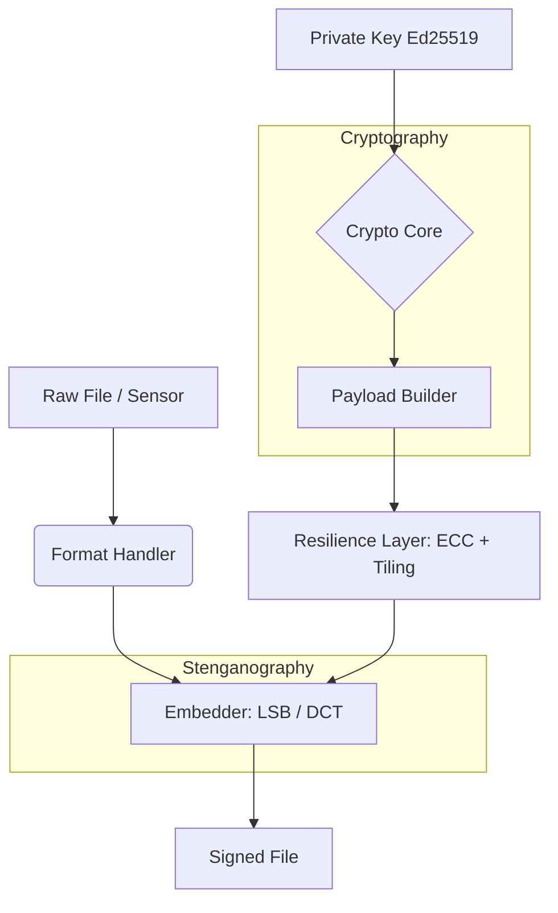

# H-Bit — Persistent Authenticity Protocol

[🇺🇸 Read in English](README_EN.md) | [🇪🇸 Leer en Español](README.md)

**H-Bit** is a universal steganographic signing system that establishes an inalienable link between intellectual authorship and any digital file: images, audio, video, PDF/Office documents, and any present or future format.

## Features

- **Universal Signing**: Signs any file format (images, audio, video, documents, generic binary)
- **Advanced Steganography**: LSB, DCT (JPEG compression-resistant), Hybrid
- **Modern Cryptography**: Ed25519, HKDF (RFC 5869), AES-256-GCM
- **Analog Resilience**: Reed-Solomon ECC, Tiling, Anchor Grid OFDM, Dewarp
- **Blockchain Integration**: Polygon Registry, C2PA Manifests
- **Forensic Analysis**: PRNU (sensor fingerprinting), Luminance Analysis
- **GPU Acceleration**: CuPy backend with automatic Numpy fallback
- **HBFS Prototype**: Authenticated File System with watchdog + identity registry

## How it Works (Technical Foundations)

H-Bit embeds the cryptographic signatures directly into the carrier medium's data layer (pixels, audio samples, DCT frequencies). Because the data is embedded at amplitudes below the **Just Noticeable Difference (JND)** threshold, it remains invisible to humans but perfectly readable by machines.

### Protocol Architecture



### Core Cryptography
The author's identity is deterministically hashed bound to their private key:
```math
AuthorHash = SHA-256(PrivateKey \parallel DeviceID \parallel SensorNoise \parallel Timestamp)
```
The payload is protected with **AES-256-GCM** and signed using **Ed25519**:
```math
Signature = Ed25519.sign(PrivateKey,\ Version \parallel Flags \parallel AuthorHash \parallel ContentHash \parallel Timestamp)
```

### Frequency Domain Embedding (DCT + QIM)
To survive lossy compression like JPEG, H-Bit modifies the mid-frequency coefficients using Quantization Index Modulation (QIM):
```math
q' = \begin{cases} q & \text{if } q \bmod 2 = b_k \\ q + \text{sgn}(F) & \text{otherwise} \end{cases}
```
The injection strength is constrained by the **Watson JND Perceptual Model**, ensuring alterations never exceed human visual perception limits:
```math
Q_s^{\text{eff}}(i,j,k) = \min\bigl(Q_s, \; 2 \cdot \text{JND}(i,j,k)\bigr)
```

## Installation

```bash
# Clone the repository
git clone https://github.com/hbit-protocol/hbit.git
cd hbit

# Install base dependencies
pip install -e .

# Install with optional extras
pip install -e ".[all]"     # raw + blockchain
pip install -e ".[dev]"     # pytest, ruff, mypy
pip install -e ".[docs]"    # mkdocs
```

### Requirements

- Python >= 3.11
- CUDA 12.x (optional, for GPU acceleration)

## Quick Start

### CLI

```bash
# Generate Ed25519 keys
hbit keygen --output my_key.pem

# Sign a file
hbit encode image.jpg --key my_key.pem --output signed.png

# Verify authenticity
hbit verify signed.png

# Decode signature
hbit decode signed.png

# View supported formats
hbit formats
```

### Python API

```python
from hbit.universal import UniversalEncoder, UniversalDecoder, UniversalVerifier

# Sign
encoder = UniversalEncoder()
result = encoder.encode("photo.jpg", "my_key.pem", "signed_photo.png")
print(f"Author: {result.author_hash}")

# Verify
verifier = UniversalVerifier()
result = verifier.verify("signed_photo.png")
print(f"Status: {result.status}")  # VERIFIED / TAMPERED / NOT_FOUND

# Decode
decoder = UniversalDecoder()
result = decoder.decode("signed_photo.png")
print(f"Timestamp: {result.timestamp}")
```

## Architecture

```
src/hbit/
├── core/           # Cryptography, KDF, Sync, Encryption, Accelerator
├── encoders/       # LSB, DCT, Hybrid
├── formats/        # Image, Audio, Video, Document, Generic
├── resilience/     # ECC, Tiling, Anchor Grid, Dewarp
├── blockchain/     # Registrar (Polygon), C2PA, Oracle
├── forensics/      # PRNU, Luminance
├── analysis/       # Entropy, Saliency, JND, Channel Selector
├── universal.py    # Universal Pipeline (Encoder/Decoder/Verifier)
├── pipeline.py     # Legacy Pipeline (Images only)
└── cli.py          # Click CLI
```

## Supported Formats

| Format | Handler | Strategy |
|---------|---------|------------|
| PNG, BMP, TIFF, WebP | ImageHandler | LSB |
| JPEG | ImageHandler | DCT (compression resistant) |
| WAV, FLAC, AIFF | AudioHandler | LSB on PCM |
| MP4, AVI, MOV | VideoHandler | LSB on keyframes |
| PDF | PDFHandler | Hidden stream |
| DOCX, XLSX, PPTX | OfficeHandler | Custom XML part |
| Any other | GenericHandler | Append stream |

## Tests

```bash
# Install development dependencies
pip install -e ".[dev]"

# Run tests
pytest

# With coverage
pytest --cov=hbit --cov-report=html
```

**Current Status**: 129/129 tests passing

## License

Apache License 2.0 — See [LICENSE](LICENSE) for more details.
